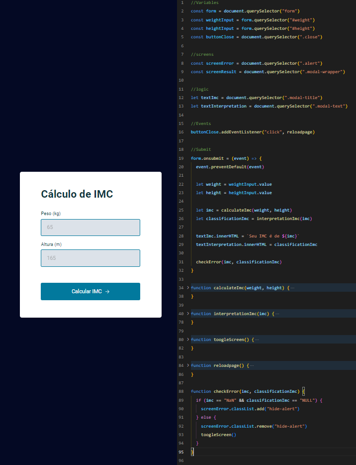
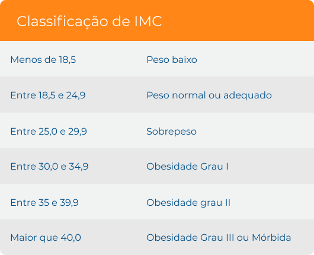

<h1 align="center"> Stage 5 - Avançando no JavaScript - Exercício - Calculo IMC 🧮 </h1>

  <a href="#-tecnologias">Tecnologias</a>&nbsp;&nbsp;&nbsp;|&nbsp;&nbsp;&nbsp;
  <a href="#-projeto">Projeto</a>&nbsp;&nbsp;&nbsp;|&nbsp;&nbsp;&nbsp;
  <a href="#-layout">Layout</a>&nbsp;&nbsp;&nbsp;|&nbsp;&nbsp;&nbsp;
  <a href="#memo-licença">Licença</a>

 

  

## 🚀 Tecnologias

Esse projeto foi desenvolvido com as seguintes tecnologias:

- HTML e CSS
- Java Script
- Git e Github
- Figma

## 💻 Projeto

Neste desafio foi criado uma calculadora de Índice de massa corpória - IMC, no qual o usuário informa sua altura e peso, e o sistema calcula seu IMC o classificando em 5 graus, descritos abaixo:

  

## 🔖 Layout

Você pode visualizar o layout do projeto através [DESSE LINK](https://www.figma.com/file/PYEbaFT50PDKWRoZIX5MHX/IMC-(Copy)?node-id=6-4&t=fUj1zRlQWTASMIMr-0). É necessário ter conta no [Figma](https://figma.com) para acessá-lo.

## :memo: Licença

Esse projeto está sob a licença MIT.

---

Feito com  ♥  by Alex Lima

Você pode acessar o Website do projeto através do link: 
<a href= "https://alima07.github.io/rocketseat-stage5-exercicio-imc/" target="_blank"> Clique aqui ⏯ </a>

